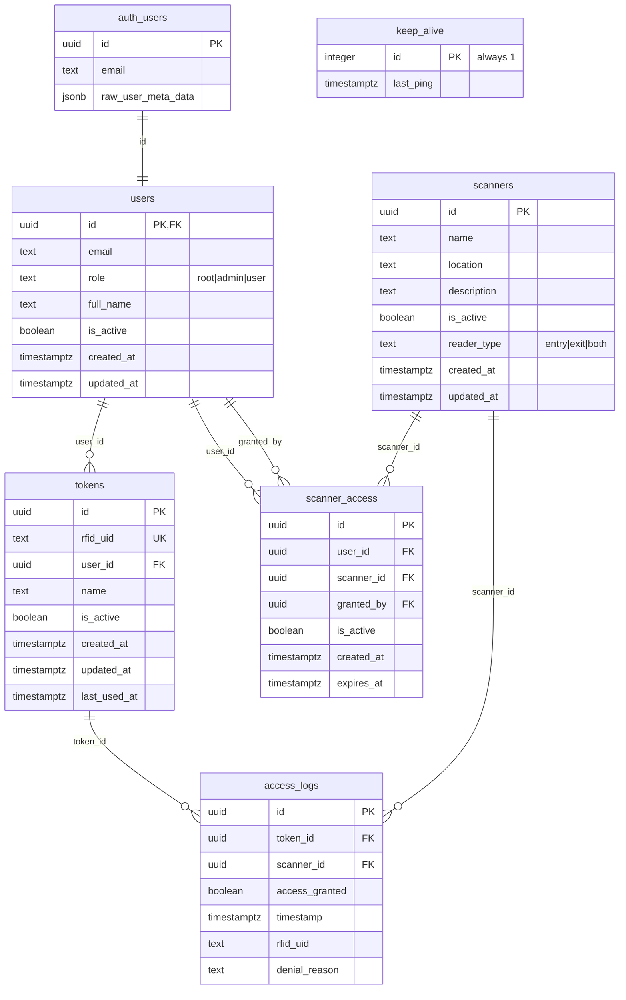

# RFID Access Control System Database

## System Description

The RFID Access Control System is an application that enables managing access to rooms using RFID cards/key fobs. The
system consists of:

- **Admin Panel** - a web application for managing users, tokens, and scanners
- **API** - an endpoint for access verification by RFID scanners
- **Supabase Database** - storing user data, tokens, scanners, and access logs

---

## Migration Usage Instructions

### Installing Supabase CLI

```bash
# macOS (Homebrew)
brew install supabase/tap/supabase

# Windows (Scoop)
scoop bucket add supabase https://github.com/supabase/scoop-bucket.git
scoop install supabase

# Linux (Homebrew)
brew install supabase/tap/supabase

# Or via npm
npm install -g supabase
```

### Running Migrations Locally

1. **Log in to Supabase CLI:**

   ```bash
   supabase login
   ```

2. **Initialize the project (if not already initialized):**

   ```bash
   supabase init
   ```

3. **Start a local Supabase instance:**

   ```bash
   supabase start
   ```

4. **Run migrations:**

   ```bash
   supabase db reset
   ```

   Or to run only new migrations:

   ```bash
   supabase migration up
   ```

### Running Migrations in Production

1. **Link the project with Supabase:**

   ```bash
   supabase link --project-ref <project-id>
   ```

2. **Run migrations in production:**

   ```bash
   supabase db push
   ```

3. **Check migration status:**
   ```bash
   supabase migration list
   ```

---

## ERD Diagram



---

## Table Descriptions

### `users`

Table storing user profiles of the system, linked to Supabase's `auth.users`.

| Column       | Type          | Description                                    |
|--------------|---------------|------------------------------------------------|
| `id`         | UUID (PK, FK) | Reference to `auth.users(id)`, cascade delete  |
| `email`      | TEXT          | User's email address                           |
| `role`       | TEXT          | User role: `root`, `admin`, or `user`          |
| `full_name`  | TEXT          | Optional full name                             |
| `is_active`  | BOOLEAN       | Whether the account is active (default `true`) |
| `created_at` | TIMESTAMPTZ   | Creation date                                  |
| `updated_at` | TIMESTAMPTZ   | Last update date                               |

**Trigger:** `on_auth_user_created` - automatically creates a user profile upon registration in `auth.users`.

---

### `scanners`

Table storing information about RFID readers/scanners.

| Column        | Type        | Description                                    |
|---------------|-------------|------------------------------------------------|
| `id`          | UUID (PK)   | Unique scanner identifier                      |
| `name`        | TEXT        | Scanner display name                           |
| `location`    | TEXT        | Physical location of the scanner               |
| `description` | TEXT        | Optional description                           |
| `is_active`   | BOOLEAN     | Whether the scanner is active (default `true`) |
| `reader_type` | TEXT        | Reader type: `entry`, `exit`, or `both`        |
| `created_at`  | TIMESTAMPTZ | Creation date                                  |
| `updated_at`  | TIMESTAMPTZ | Last update date                               |

---

### `tokens`

Table storing RFID tokens (cards/key fobs) assigned to users.

| Column         | Type          | Description                                      |
|----------------|---------------|--------------------------------------------------|
| `id`           | UUID (PK)     | Unique token identifier                          |
| `rfid_uid`     | TEXT (UNIQUE) | Unique UID of the RFID card/key fob              |
| `user_id`      | UUID (FK)     | Reference to the token owner                     |
| `name`         | TEXT          | Token name (e.g., "Main card", "Backup key fob") |
| `is_active`    | BOOLEAN       | Whether the token is active (default `true`)     |
| `created_at`   | TIMESTAMPTZ   | Creation date                                    |
| `updated_at`   | TIMESTAMPTZ   | Last update date                                 |
| `last_used_at` | TIMESTAMPTZ   | Date of last token usage                         |

---

### `scanner_access`

Table storing user access permissions to scanners.

| Column       | Type        | Description                                       |
|--------------|-------------|---------------------------------------------------|
| `id`         | UUID (PK)   | Unique permission identifier                      |
| `user_id`    | UUID (FK)   | Reference to the user                             |
| `scanner_id` | UUID (FK)   | Reference to the scanner                          |
| `granted_by` | UUID (FK)   | Reference to the user who granted the permission  |
| `is_active`  | BOOLEAN     | Whether the permission is active (default `true`) |
| `created_at` | TIMESTAMPTZ | Date when permission was granted                  |
| `expires_at` | TIMESTAMPTZ | Optional permission expiration date               |

**Constraint:** `UNIQUE (user_id, scanner_id)` - a user can have only one permission per scanner.

---

### `access_logs`

Table storing logs of all access attempts (successful and unsuccessful).

| Column           | Type        | Description                                       |
|------------------|-------------|---------------------------------------------------|
| `id`             | UUID (PK)   | Unique entry identifier                           |
| `token_id`       | UUID (FK)   | Reference to the token (NULL if token unknown)    |
| `scanner_id`     | UUID (FK)   | Reference to the scanner                          |
| `access_granted` | BOOLEAN     | Whether access was granted                        |
| `timestamp`      | TIMESTAMPTZ | Time of access attempt                            |
| `rfid_uid`       | TEXT        | Scanned RFID UID (stored even for unknown tokens) |
| `denial_reason`  | TEXT        | Reason for access denial (if denied)              |

---

### `keep_alive`

Helper table for the cron job maintaining database activity.

| Column      | Type         | Description                       |
|-------------|--------------|-----------------------------------|
| `id`        | INTEGER (PK) | Always equals 1 (only one record) |
| `last_ping` | TIMESTAMPTZ  | Time of last ping                 |

---

## RPC Function Descriptions

### `check_rfid_access(p_scanner_id UUID, p_token_uid TEXT)`

Main function for checking RFID access. Called by the API on each card scan.

**Parameters:**

- `p_scanner_id` - UUID of the scanner where the scan was performed
- `p_token_uid` - UID of the scanned RFID card

**Returns:** JSONB with the following structure:

```json
{
    "success": true
    |
    false,
    "error": "error message or null",
    "error_code": "error code or null",
    "access": {
        "granted": true
        |
        false,
        "until": "expiration date or null",
        "denyReason": "denial reason or null"
    },
    "data": {
        "rfid_uid": "scanned UID",
        "user_id": "user UUID or null",
        "scanner_id": "scanner UUID"
    },
    "timestamp": "check time"
}
```

**Error Codes:**
| Code | Description |
|-----|------|
| `SCANNER_NOT_FOUND` | Scanner with the given ID does not exist |
| `SCANNER_DISABLED` | Scanner is disabled |
| `TOKEN_NOT_FOUND` | Token with the given UID does not exist |
| `TOKEN_DISABLED` | Token is disabled |
| `USER_NOT_FOUND` | User assigned to the token does not exist |
| `USER_DISABLED` | User is disabled |
| `NO_ACCESS` | User does not have permission for this scanner |
| `ACCESS_DISABLED` | Access permission is disabled |
| `ACCESS_EXPIRED` | Access permission has expired |

**Operation:**

1. Checks if the scanner exists and is active
2. Checks if the token exists and is active
3. Checks if the user exists and is active
4. Checks if the user has an active, non-expired permission for the scanner
5. Logs the access attempt to `access_logs`
6. Updates the token's `last_used_at` on successful access

---

## RLS (Row Level Security) Policies

All tables have RLS enabled. Below is a summary of policies:

### Table `users`

| Policy                       | Operation | Role          | Description                  |
|------------------------------|-----------|---------------|------------------------------|
| `users_select_authenticated` | SELECT    | authenticated | All logged-in users can read |
| `users_update_service_role`  | UPDATE    | service_role  | Only service_role can update |
| `users_delete_service_role`  | DELETE    | service_role  | Only service_role can delete |
| `users_insert_service_role`  | INSERT    | service_role  | Only service_role can insert |

### Table `scanners`

| Policy                          | Operation | Role          | Description                  |
|---------------------------------|-----------|---------------|------------------------------|
| `scanners_select_authenticated` | SELECT    | authenticated | All logged-in users can read |
| `scanners_insert_service_role`  | INSERT    | service_role  | Only service_role can insert |
| `scanners_update_service_role`  | UPDATE    | service_role  | Only service_role can update |
| `scanners_delete_service_role`  | DELETE    | service_role  | Only service_role can delete |

### Table `tokens`

| Policy                        | Operation | Role          | Description                  |
|-------------------------------|-----------|---------------|------------------------------|
| `tokens_select_authenticated` | SELECT    | authenticated | All logged-in users can read |
| `tokens_insert_service_role`  | INSERT    | service_role  | Only service_role can insert |
| `tokens_update_service_role`  | UPDATE    | service_role  | Only service_role can update |
| `tokens_delete_service_role`  | DELETE    | service_role  | Only service_role can delete |

### Table `scanner_access`

| Policy                                | Operation | Role          | Description                  |
|---------------------------------------|-----------|---------------|------------------------------|
| `scanner_access_select_authenticated` | SELECT    | authenticated | All logged-in users can read |
| `scanner_access_insert_service_role`  | INSERT    | service_role  | Only service_role can insert |
| `scanner_access_update_service_role`  | UPDATE    | service_role  | Only service_role can update |
| `scanner_access_delete_service_role`  | DELETE    | service_role  | Only service_role can delete |

### Table `access_logs`

| Policy                             | Operation | Role          | Description                                     |
|------------------------------------|-----------|---------------|-------------------------------------------------|
| `access_logs_select_authenticated` | SELECT    | authenticated | Only users with `root` or `admin` role can read |
| `access_logs_insert_service_role`  | INSERT    | service_role  | Only service_role can insert                    |
| `access_logs_update_service_role`  | UPDATE    | service_role  | Only service_role can update                    |
| `access_logs_delete_service_role`  | DELETE    | service_role  | Only service_role can delete                    |

### Table `keep_alive`

| Policy                               | Operation | Role          | Description                  |
|--------------------------------------|-----------|---------------|------------------------------|
| `Allow read for authenticated users` | SELECT    | authenticated | All logged-in users can read |
| `Allow update for service_role`      | UPDATE    | service_role  | Only service_role can update |

---

## Migration Files List

| File                                                   | Description                                                                                           |
|--------------------------------------------------------|-------------------------------------------------------------------------------------------------------|
| `20251221123000_create_keep_alive_table.sql`           | Creates `keep_alive` table for cron job maintaining database activity                                 |
| `20251221130000_create_users_table.sql`                | Creates `users` table, `handle_new_user()` function, sync trigger with `auth.users`, and RLS policies |
| `20251221130100_create_scanners_table.sql`             | Creates `scanners` table with RLS policies                                                            |
| `20251221130200_create_tokens_table.sql`               | Creates `tokens` table with RLS policies                                                              |
| `20251221130300_create_scanner_access_table.sql`       | Creates `scanner_access` table with RLS policies                                                      |
| `20251221130400_create_access_logs_table.sql`          | Creates `access_logs` table with RLS policies (restricted read for root/admin)                        |
| `20251221130500_create_check_rfid_access_function.sql` | Creates `check_rfid_access()` RPC function for access verification                                    |
| `20251221130600_create_indexes.sql`                    | Creates performance indexes for all tables                                                            |
| `20251221130700_create_updated_at_triggers.sql`        | Creates `update_updated_at_column()` function and triggers for automatic `updated_at` updates         |

---

## Indexes

The system uses the following indexes for performance optimization:

| Index                           | Table          | Column         | Description                        |
|---------------------------------|----------------|----------------|------------------------------------|
| `idx_tokens_rfid_uid`           | tokens         | rfid_uid       | Fast token lookup by UID           |
| `idx_tokens_user_id`            | tokens         | user_id        | Fast lookup of user's tokens       |
| `idx_scanner_access_user_id`    | scanner_access | user_id        | Fast lookup of user's permissions  |
| `idx_scanner_access_scanner_id` | scanner_access | scanner_id     | Fast lookup of scanner permissions |
| `idx_access_logs_timestamp`     | access_logs    | timestamp DESC | Fast retrieval of recent logs      |
| `idx_access_logs_scanner_id`    | access_logs    | scanner_id     | Filtering logs by scanner          |
| `idx_access_logs_token_id`      | access_logs    | token_id       | Filtering logs by token            |
| `idx_access_logs_rfid_uid`      | access_logs    | rfid_uid       | Filtering logs by RFID UID         |

---

## Triggers

| Trigger                      | Table      | Event         | Description                                              |
|------------------------------|------------|---------------|----------------------------------------------------------|
| `on_auth_user_created`       | auth.users | AFTER INSERT  | Automatically creates profile in `users` on registration |
| `update_users_updated_at`    | users      | BEFORE UPDATE | Automatically updates `updated_at`                       |
| `update_scanners_updated_at` | scanners   | BEFORE UPDATE | Automatically updates `updated_at`                       |
| `update_tokens_updated_at`   | tokens     | BEFORE UPDATE | Automatically updates `updated_at`                       |
